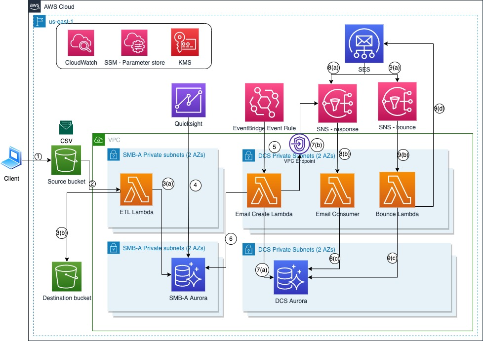

# smba-dcs
This is the code repository for SMB Automation Tool (SMBA) and Digital Customer Success (DCS)

SMBA
SMBA is an analytical business intelligence solution that helps SMB CSMs monitor and manage MAP 2.0 migrations at scale. The tool was home-grown and developed by SMB CSMs. It ingests data from a Migration Success OneView Dashboard and Salesforce, and runs custom business logic to proactively identify issues and blockers with MAP 2.0 migrations. It makes recommendations to CSMs on corrective actions as well as determines the status of a migration based on thresholds around timelines to complete initialization steps (e.g. CUR setup, Cost Allocation Tag Activation, Tagging Workloads) and tagged revenue run-rate based on AWS Finance Projections. It saves an SMB CSM about 70 hours of analysis time each month due to automatic insights it provides.

DCS
DCS is a data-driven methodology to facilitate a personalized customer experience regardless of a customer’s segment or lifecycle stage. We are piloting DCS in SMB and to initially provide tech-touch support, without human intervention to MAP 2.0 migrations as new customers onboard. 

Architecture diagram

